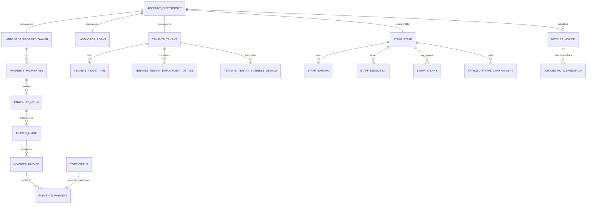

# Database Architecture (ERD)

Welcome! This guide explains how the AdminRealEstate database is organised and how each table (model) relates to the others. If you are new to Django or relational databases, start with the **Quick Start** section and work your way down.

## Quick Start
1. **Check the database engine** – we use MySQL / MariaDB through the `mysql.connector.django` driver.
2. **Run migrations** to create the schema:
   ```bash
   python manage.py makemigrations
   python manage.py migrate
   ```
3. **Open the ERD diagram** below to grasp the big picture.

## Visual ERD
The following Mermaid diagram renders directly in most Markdown viewers (GitHub, GitLab, VS Code, etc.). If your viewer does not support Mermaid, copy the diagram into https://mermaid.live.



> **Tip:** Export a PNG or SVG from Mermaid Live and store it under `docs/diagrams/` (already gitignored) if you need to embed visual assets elsewhere.

## Connection Details
- **Engine**: MySQL 5.7+ / MariaDB 10.4+
- **Driver**: `mysql.connector.django`
- **Default credentials (dev)**: see `AdminRealEstate/settings.py`
- **Recommended override**: use environment variables in your `.env` file (`DB_NAME`, `DB_USER`, `DB_PASSWORD`, `DB_HOST`, `DB_PORT`).

To connect using the MySQL CLI:
```bash
mysql -h localhost -P 3306 -u <user> -p realestate
```

## Entity Glossary
Below is a beginner-friendly description of each major table. Django automatically creates the underlying table names by combining the app label and model name (e.g., `account.CustomUser` → `account_customuser`).

### 1. Authentication & Profiles
- **`account.CustomUser`** – Central user table with email login, role flag (`user_type`), and profile picture. Every other persona links back here.
- **`landlords.PropertyOwner` / `landlords.Agent`** – One-to-one “profile extensions” for owners and their delegated agents. Agents belong to a property owner.
- **`staff.Staff`** – Staff profile detailing position, start date, and HR attributes.
- **`tenants.Tenant`** – Tenant profile, connected to onboarding user and storing contact details.

### 2. Property Inventory
- **`property.Property`** – A physical building/complex owned by a property owner.
- **`property.Units`** – Individual rentable units (apartments, studios, offices) within a property.
- **`property.PropertyImages` / `property.PropertyUnitImages`** – Media galleries for marketing.

### 3. Lease & Billing Cycle
- **`leases.Lease`** – Agreement linking a tenant to a specific unit, recording rent, security deposit, and activity status.
- **`leases.LeaseTerm`** – Extra clauses per lease (utility charges, fines, etc.).
- **`invoices.Invoice`** – Billing records generated for a lease. Tracks amount, balance, status, and due dates.
- **`payments.Payment`** – Cash or M-Pesa transactions against invoices.

### 4. Tenant Context
- **`tenants.Tenant_Kin`** – Next-of-kin contact details.
- **`tenants.Tenant_Employment_Details` / `tenants.Tenant_Business_Details`** – Employment or business documentation for risk assessment.

### 5. Staff Payroll
- **`staff.Earning` / `staff.Deduction`** – Line items that contribute to payroll calculations.
- **`staff.StaffSalary`** – Aggregated earnings/deductions per staff member.
- **`payroll.StaffSalaryPayment`** – Final monthly payroll entries.

### 6. Communication & Configuration
- **`notices.Notice`** – Announcements authored by a user, optionally targetting specific audiences.
- **`notices.NoticeFeedback`** – Replies to notices.
- **`notices.Enquiries`** – External contact form submissions.
- **`core.SiteConfig`** – Key/value feature toggles.
- **`core.Setup`** – Stores SMTP and M-Pesa credentials consumed by email and payment utilities.

## Relationship Walkthrough
1. **Owners manage properties**: `CustomUser` (Owner) → `PropertyOwner` → `Property` → `Units`.
2. **Tenants occupy units**: `CustomUser` (Tenant) → `Tenant` → `Lease` → `Invoice` → `Payment`.
3. **Staff keep operations running**: `CustomUser` (Staff) → `Staff` → `StaffSalary` → `Payroll`.
4. **Communication loops**: Any `CustomUser` can create `Notice` entries; recipients can respond via `NoticeFeedback`.
5. **Configuration**: `core.Setup` is read across the payment/email stack to avoid hardcoding credentials in code.

## How to Inspect the Schema Yourself
```bash
# View the SQL generated for a model
python manage.py sqlmigrate invoices 0001

# Open the Django shell and explore relationships interactively
python manage.py shell
>>> from leases.models import Lease
>>> lease = Lease.objects.first()
>>> lease.invoices.all()
```

## Next Steps
- Need the business context? Read the [Implementation Overview](./implementation.md).
- Want the full user journey? See the [Project Planning](./plan.md) guide for DFDs and roadmaps.
- Prefer visual tools? Export Mermaid diagrams as PNG/SVG and drop them under `docs/diagrams/`.
