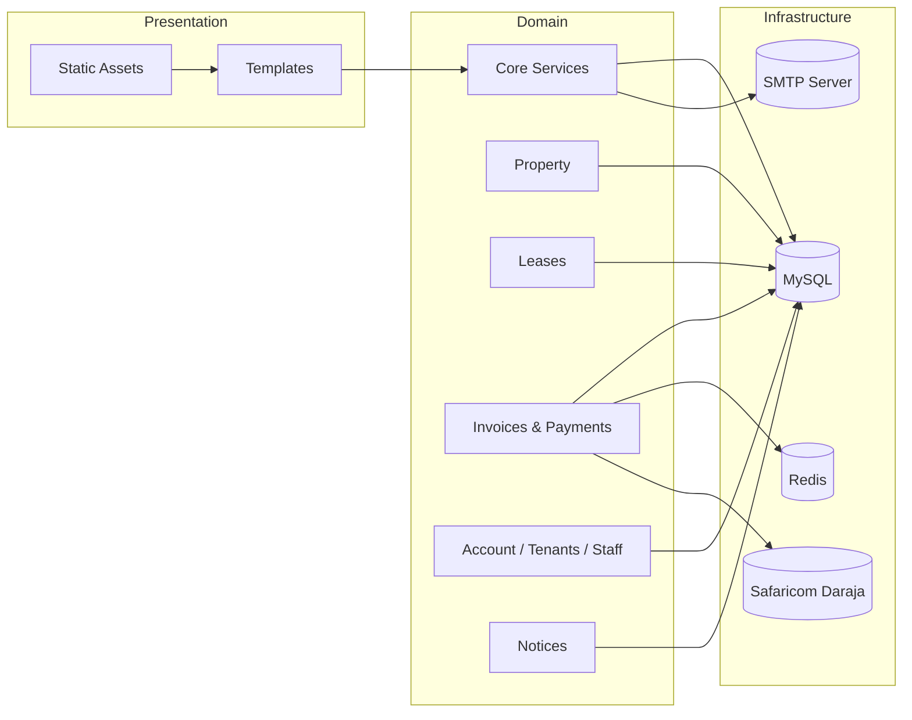
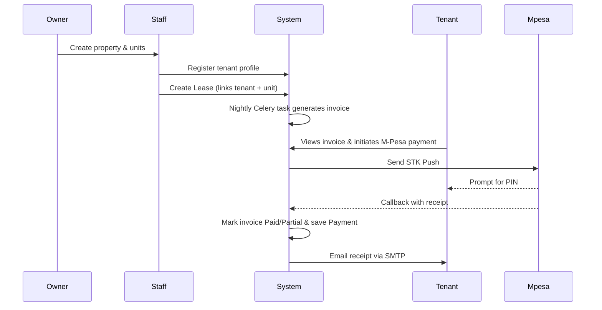

# Implementation Overview

This guide breaks down how the AdminRealEstate codebase is put together. If you are still learning Django, think of each “app” as a feature module. We’ll start with a birds-eye view and then walk feature-by-feature so you always know **where to look** and **how things work together**.

## Architecture at a Glance

- **Framework**: Django 3.2 (Python 3.10+)
- **Database**: MySQL / MariaDB via `mysql-connector-python`
- **Async Tasks**: Celery workers with Redis broker & result backend
- **Frontend**: Django templates + static assets (CSS/JS in `static/`)
- **Admin Enhancements**: Jazzmin theme & TinyMCE rich text editor
- **Document/PDF**: `xhtml2pdf`, `pyHanko`, `reportlab`, `svglib`, `pypdf`
- **Messaging**: SMTP email + Safaricom M-Pesa STK push

### System Layers


## How the Major Apps Fit Together

| App | What it owns | Why it matters for beginners |
| --- | --- | --- |
| `account` | Custom user model + login middlewares | Sets up role-based access (Owner, Agent, Staff, Tenant). Every other app relies on these roles. |
| `core` | Dashboards, context processors, global config (`Setup`) | Stores SMTP & M-Pesa credentials, so you never hardcode secrets in code. |
| `landlords` & `property` | Owner/agent profiles and property inventory | Think “supply side”: who owns what and which units are available. |
| `tenants` | Tenant onboarding plus kin/employment/business info | Captures the “demand side” data that flows into leases and invoices. |
| `leases` | Binds tenants to units and enforces contract details | Triggers billing and payment workflows. |
| `invoices` | Generates charges for each lease | Provides the numbers that need to be collected. |
| `payments` | Records cash and M-Pesa transactions | Updates invoice balances and sends receipts. |
| `staff` & `payroll` | Internal workforce and salary calculations | Useful if you run payroll out of the same system. |
| `notices` | Broadcast and targeted announcements | Keeps stakeholders informed (vacate notices, reminders, etc.). |
| `utilities` | Placeholder for future utility billing | Safe space to extend the platform without touching core billing. |

## Key End-to-End Flows

### 1. Onboard → Lease → Invoice → Pay


### 2. Cash Payment (Back Office)
1. Staff opens the cash payment form (`payments.views.PaymentCreateView`).
2. The form writes a `Payment` record and updates the invoice balance.
3. `core.utils.MailSender` emails the tenant if configured.

### 3. Email Broadcast
1. Admin creates a `Notice` targeting a role (e.g., Tenants).
2. `core.middleware.SiteWideConfigs` ensures branding info is injected.
3. Tenants see notices on their dashboard; can reply via `NoticeFeedback`.

## Integrations Explained

### Safaricom M-Pesa (STK Push)
- **Where the code lives**: `payments/mpesa_credentials.py`, `payments/views.py`, `payments/forms.py`.
- **Credentials**: Stored in `core.Setup`. Sandbox defaults exist so you can test immediately.
- **Happy path**:
  1. `MpesaAccessToken` pulls credentials, fetches an access token.
  2. `LipanaMpesaPpassword` builds the dynamic password & timestamp.
  3. STK request is sent; callback view (`MpesaCallbackView`) saves the `Payment`.
  4. Invoices are updated and notifications sent.
- **Local tip**: Use https://ngrok.com to expose your callback URL while developing.

### Email Delivery
- **Module**: `core.utils.MailSender`
- **Configuration**: `core.Setup` fields (host, port, TLS, credentials).
- **Behaviour**: Uses Django’s `EmailMultiAlternatives` to send HTML + plain text versions. Runs in a background thread so the user UI stays snappy.

### Celery Scheduling
- **Entrypoint**: `celery.py`
- **Worker command**: `celery -A AdminRealEstate worker -l INFO`
- **Beat command**: `celery -A AdminRealEstate beat -l INFO`
- **Default schedule**: `generate_invoices` runs nightly at midnight (`invoices.tasks`).
- **Redis usage**: Broker + result backend. Configure via `CELERY_BROKER_URL` / `CELERY_RESULT_BACKEND`.

## Security & Best Practices
- Keep `.env` secrets out of source control. `core.Setup` is a convenience layer, not a substitute for secret management.
- Restrict invoice creation to roles allowed in `InvoiceCreateView.dispatch`.
- Validate user-supplied HTML (TinyMCE) before exposing it publicly.
- Audit payment callbacks: log all payloads, secure your callback URL with HTTPS.

## Static & Media Handling
- Static assets live in `static/` and are served via Whitenoise (`CompressedManifestStaticFilesStorage`).
- `media/` stores user uploads (profile pictures, documents). Configure durable storage (S3, Azure Blob) before going live.
- Run `python manage.py collectstatic` when packaging for deployment.

## Extending the Platform
- **Add a new module**: run `python manage.py startapp utilities` (already present but empty) and hook into `INSTALLED_APPS`.
- **Create APIs**: add DRF or simple Django views under each app’s `views.py`.
- **Automate more tasks**: drop Celery tasks under `<app>/tasks.py` and they’ll auto-discover.

## Where to Go Next
- Dive into the [Database ERD](./erd.md) for table-by-table details.
- Follow the [Setup Guide](./setup.md) to run the project locally.
- Review the [Project Plan](./plan.md) for roadmap ideas and DFD visuals.

Questions while reading the code? Open the Django shell:
```bash
python manage.py shell
>>> from payments.models import Payment
>>> Payment.objects.select_related("invoice").last()
```

You now know which app to open when you need to change a feature, where integrations live, and how data flows end-to-end.
