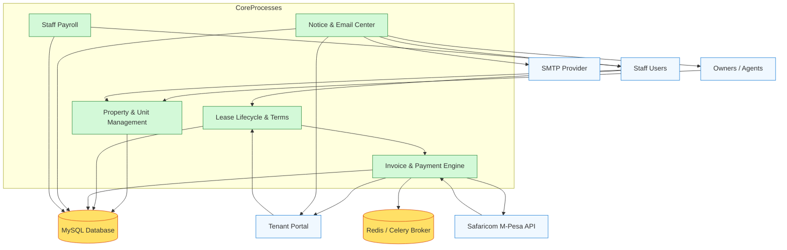

# Project Planning Overview

Think of this document as the “movie trailer” for the entire platform. It stitches together the documentation set, renders a visual data-flow, and outlines the roadmap so you can quickly understand what exists today and what to build next.

## Documentation Map
1. **[Setup Guide](./setup.md)** – Step-by-step Windows install with every command explained.
2. **[Implementation Overview](./implementation.md)** – Tour of Django apps, integrations, and core workflows.
3. **[Database ERD](./erd.md)** – Entity glossary plus a Mermaid ER diagram.

## Level 0 Data Flow Diagram (DFD)
The diagram below shows the main actors and systems that exchange information. Copy it into https://mermaid.live if your viewer doesn’t render Mermaid.

> **Why it matters:** Whenever you add a new feature or integration, decide where it sits in this flow. Does it extend Property Management? Does it require a new external actor? Keep the DFD up to date.

## Level 1 Breakdown
1. **Property & Tenant Intake** – Owners/Staff create properties and units. Staff register tenants, activate leases, and capture extra paperwork (kin/employment/business).
2. **Billing Automation** – Celery beat fires nightly, generating invoices for active leases. Staff can adjust invoices manually via the admin.
3. **Payment Processing** – Tenants pay via cash or M-Pesa. Cash flows are recorded manually; M-Pesa STK pushes trigger callbacks that reconcile balances.
4. **Communications Hub** – Notices broadcast updates in-app; `MailSender` pushes transactional emails (receipts, onboarding, etc.).
5. **Back-office Payroll** – Staff earnings, deductions, and monthly payroll runs keep internal finances transparent.

## Suggested Roadmap
| Priority | Initiative | Notes |
| --- | --- | --- |
| ⭐ High | Automated test suite | Start with leases, invoices, payments. Use Django’s test runner or pytest. |
| ⭐ High | Environment templating | Create `.env.example`, integrate `django-environ`, document production overrides. |
| ⭐ High | Containerisation | Docker Compose stack for Django, MySQL, Redis, Celery worker/beat. |
| ⭐ Medium | Utilities module expansion | Model utility usage (water, power) to bill alongside rent. |
| ⭐ Medium | Notification templates | Centralise HTML templates for emails & notices; add preview UI. |
| ⭐ Low | Analytics dashboards | Extend `core` with charts for occupancy, revenue, arrears. |

Update this table as priorities shift. Link relevant GitHub issues when possible.

## Quick Reference Links
- **Celery schedule & task definitions** → `celery.py`, `invoices/tasks.py`
- **M-Pesa credential loader** → `payments/mpesa_credentials.py`
- **Payment views & callbacks** → `payments/views.py`
- **Email utility** → `core/utils.py`
- **Role-based middleware & demo seeding** → `account/middleware.py`

## How to Maintain This Plan
1. **After each release**: capture new workflows in the Mermaid diagram.
2. **When documenting a feature**: ensure the roadmap table reflects its status.
3. **When sharing with stakeholders**: export diagrams to `docs/diagrams/` and attach the Markdown links.

Need more detail on data structures or setup steps? Jump back to the linked documentation at the top.
